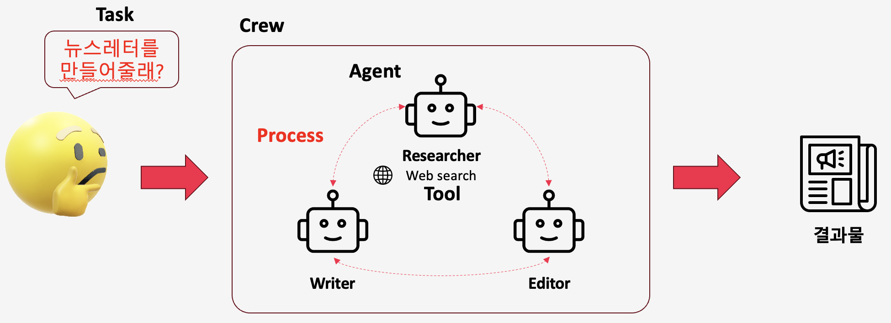
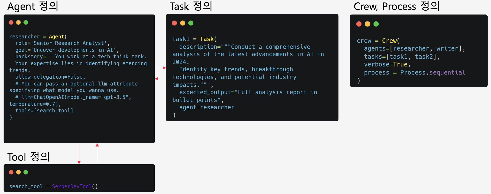

# CrewAI Demo Codes

## CrewAI 설명 
Crew AI는 Tool, Agent, Task와 이들을 통합한 Crew로 이루어져있습니다. 
다양한 Agent(LLM)가 Crew로 묶여 Tool을 호출하며 Task를 다양한 수행하게됩니다. 

코드의 구성은 아래와 같습니다. 

### 🛠️ Tool 
Agent가 사용하는 툴로 기본 정의된 tool과 커스텀 tool이 존재한다. </br>
기본 내장 tool은 아래의 코드를 통해 리스트를 확인 가능하다. </br>
```python
from crewai import CrewAI

client = CrewAI(api_key="YOUR_API_KEY")
for tool in client.list_tools():
    print(f"- {tool.name}: {tool.description}")
```
그리고 아래의 명령어와 같이 코드에서 도구 인스턴스를 정의해야 이후 Agent가 사용 가능하다. 
```python 
from crewai_tools import (
    SerperDevTool,
    WebsiteSearchTool,
    ScrapeWebsiteTool
)
# 도구 인스턴스 생성
search_tool = SerperDevTool()        # 웹 검색 API 도구. 정보가 있는 웹사이트를 검색
web_rag_tool = WebsiteSearchTool()   # 웹사이트 안에서 RAG를 해서 필요한 정보 가져옴. 자동으로 db파일 생성됨
scrap_tool = ScrapeWebsiteTool()     #  웹 스크래핑 도구

```
커스텀 tool은 04_custom_tool.py를 통해서 어떻게 만들고 쓰는지 확인 가능하다. </br>
### 🤖 Agent 
Agent는 Task를 수행하는 LLM으로 아래와 같이 구성된다. 
```python
researcher = Agent(
    role='Senior Research Analyst',           # 역할 (필수)
    goal='Uncover developments in AI',        # 목표 (필수)
    backstory="You work at a tech think tank.", # 배경 스토리 (선택)
    allow_delegation=False,                   # 작업 위임 허용 여부 (선택)
    tools=[search_tool]                       # 사용할 도구 목록 (선택)
)
```
Agent 주요 매개변수 
| Parameter              | 타입           | 예시 값                                                                                          | 설명                           |
| ---------------------- | ------------ | --------------------------------------------------------------------------------------------- | ---------------------------- |
| **role**\*             | `str`        | `'Senior Research Analyst'`                                                                   | 에이전트의 역할을 정의. 수행할 작업 유형 결정   |
| **goal**\*             | `str`        | `'Uncover developments in AI'`                                                                | 에이전트의 개별 목표 설정               |
| backstory              | `str`        | `"""You work at a tech think tank...\nYour expertise lies in identifying emerging trends."""` | 역할·목표에 대한 맥락 제공              |
| llm                    | `BaseLLM`    | `ChatOpenAI(model_name="gpt-3.5", temperature=0.7)`                                           | 에이전트를 실행할 언어 모델 지정           |
| function\_calling\_llm | `BaseLLM`    | `ChatOpenAI(model_name="gpt-4-0613")`                                                         | 도구 호출 전용 언어 모델 지정            |
| tools                  | `List[Tool]` | `[search_tool, memory_tool]`                                                                  | 에이전트가 사용할 수 있는 도구 리스트        |
| max\_iter              | `int`        | `50`                                                                                          | 최대 반복 수행 횟수 (기본 25)          |
| max\_rpm               | `int`        | `60`                                                                                          | 분당 최대 요청 수 (속도 제한 방지)        |
| max\_execution\_time   | `int`        | `120`                                                                                         | 작업 실행 최대 시간(초)               |
| verbose                | `bool`       | `True`                                                                                        | 상세 실행 로그 제공 여부 (기본 False)    |
| allow\_delegation      | `bool`       | `False`                                                                                       | 에이전트 간 작업 위임 허용 여부 (기본 True) |
| step\_callback         | `Callable`   | `my_step_logger`                                                                              | 각 단계 완료 후 호출되는 함수 (로깅 등)     |
| cache                  | `bool`       | `True`                                                                                        | 도구 결과 캐시 사용 여부 (기본 True)     |
| system\_template       | `str`        | `"You are an agent that prioritizes accuracy."`                                               | 시스템 메시지 템플릿 지정               |
| prompt\_template       | `str`        | `"Process the user's query and return a summary."`                                            | 프롬프트 템플릿 지정                  |
| response\_template     | `str`        | `"Return JSON with fields: {result, reasoning}."`                                             | 응답 템플릿 지정                    |
| allow\_code\_execution | `bool`       | `False`                                                                                       | 코드 실행 허용 여부 (기본 False)       |
| max\_retry\_limit      | `int`        | `2`                                                                                           | 오류 시 최대 재시도 횟수 (기본 2)        |

### 🎯 Task 
Agent 가 수행하게될 과제로 아래와 같이 구성된다. 
```python
task1 = Task(
    description="Conduct a comprehensive analysis of the latest advancements in AI in 2024. Identify key trends, breakthrough technologies, and potential industry impacts.",  # required
    expected_output="Full analysis report in bullet points",                                                                # required
    agent=researcher,                                                                                                       # required
    tools=[search_tool, summarize_tool],                                                                                    # optional
    async_execution=False,                                                                                                  # optional
    context=[previous_task],                                                                                                # optional
    callback=on_task_complete                                                                                               # optional
)
```

Task 주요 매개변수 
| Parameter              | 타입                            | 예시 값                                      | 설명                            |
| ---------------------- | ----------------------------- | ----------------------------------------- | ----------------------------- |
| **description**\*      | `str`                         | `"Conduct a comprehensive analysis …"`    | 작업의 간단한 설명                    |
| **agent**\*            | `Agent`                       | `researcher`                              | 작업 수행 책임자                     |
| **expected\_output**\* | `str`                         | `"Full analysis report in bullet points"` | 작업 완료 결과물 설명                  |
| tools                  | `List[Tool]`                  | `[search_tool, summarize_tool]`           | 사용 가능한 기능(툴) 목록               |
| async\_execution       | `bool`                        | `False`                                   | 비동기 실행 여부 (기본값 False)         |
| context                | `List[Task]`                  | `[previous_task]`                         | 이 작업의 맥락이 되는 다른 작업들           |
| config                 | `Dict[str, Any]`              | `{"retry_on_failure": True}`              | 추가 설정 세부사항 (기본값 None)         |
| output\_json           | `bool`                        | `True`                                    | JSON 형태로 출력할지 여부              |
| output\_pydantic       | `Type[BaseModel]`             | `AnalysisResultModel`                     | Pydantic 모델 객체로 출력            |
| output\_file           | `str`                         | `"analysis_report.md"`                    | 결과를 파일로 저장                    |
| output                 | `TaskOutput`                  | `custom_output_handler`                   | TaskOutput 인스턴스 또는 다양한 형식의 출력 |
| callback               | `Callable[[Task, Any], None]` | `on_task_complete`                        | 작업 완료 시 호출되는 함수               |
| human\_input           | `bool`                        | `False`                                   | 인간의 피드백 필요 여부 (기본값 False)     |
| converter\_cls         | `Type`                        | `MyOutputConverter`                       | 구조화된 출력 변환 클래스 (기본값 None)     |

### 👨‍✈️👨🏻‍✈️👩‍✈️ Crew 
Agent와 Task의 집합으로 구성되며 아래와 같이 구성된다. 
```python
crew = Crew(
    agents=[researcher, writer],                        # 팀 구성원 리스트*
    tasks=[task1, task2],                               # 작업 리스트*
    process=Process.sequential,                         # 작업 순서 (선택: sequential, hierarchical 등)
    verbose=True,                                       # 실행 중 로깅 상세도 (선택)
    manager_llm=ChatOpenAI(model_name="gpt-4-0613"),    # 매니저 에이전트용 LLM (선택)
    max_rpm=60,                                         # 분당 최대 요청 수 (선택)
    language="ko",                                      # 팀 사용 언어 (선택, 기본 "en")
    cache=False                                         # 도구 결과 캐시 사용 여부 (선택)
)
```
Crew 주요 매개변수 
| Parameter              | 타입                            | 예시 값                                          | 설명                                            |
| ---------------------- | ----------------------------- | --------------------------------------------- | --------------------------------------------- |
| **agents**\*           | `List[Agent]`                 | `[researcher, writer]`                        | 팀에 속한 에이전트 리스트                                |
| **tasks**\*            | `List[Task]`                  | `[task1, task2]`                              | 팀에 할당된 작업 리스트                                 |
| process                | `Process` enum                | `Process.sequential`                          | 팀이 따르는 작업 순서 (`sequential`, `hierarchical` 등) |
| verbose                | `bool`                        | `True`                                        | 실행 중 콘솔에 상세 로그 출력 여부                          |
| manager\_llm           | `BaseLLM`                     | `ChatOpenAI(model_name="gpt-4-0613")`         | 계층적 프로세스에서 매니저 에이전트가 사용할 LLM                  |
| function\_calling\_llm | `BaseLLM`                     | `ChatOpenAI(model_name="gpt-3.5-0613")`       | 도구 호출 담당 에이전트가 사용할 LLM                        |
| config                 | `Dict[str, Any]`              | `{"retry_on_failure": True}`                  | 추가 팀 설정(JSON/Dict)                            |
| max\_rpm               | `int`                         | `60`                                          | 분당 최대 요청 수                                    |
| language               | `str`                         | `"ko"`                                        | 팀 사용 언어 (`"en"`, `"ko"`, `"ja"` 등)            |
| language\_file         | `str`                         | `"/path/to/lang.json"`                        | 사용할 언어 파일 경로                                  |
| memory                 | `Memory`                      | `LongTermMemory()`                            | 실행 중 사용할 메모리 시스템                              |
| cache                  | `bool`                        | `False`                                       | 도구 실행 결과 캐시 사용 여부                             |
| embedder               | `Any`                         | `SomeEmbeddingClass()`                        | 팀이 사용할 임베딩 구성 (주로 메모리용)                       |
| full\_output           | `bool`                        | `True`                                        | 각 단계 출력 모두 반환 여부 (`False`는 최종 출력만)            |
| step\_callback         | `Callable[[Agent, Any], Any]` | `on_step_complete`                            | 각 에이전트 단계 완료 후 호출될 콜백 함수                      |
| task\_callback         | `Callable[[Task, Any], Any]`  | `on_task_complete`                            | 각 테스크 완료 후 호출될 콜백 함수                          |
| share\_crew            | `bool`                        | `True`                                        | crewAI 팀과 정보 공유 동의 여부                         |
| output\_log\_file      | `bool`                        | `True`                                        | 전체 실행 로그 파일 생성 여부                             |
| manager\_agent         | `Agent`                       | `custom_manager`                              | 사용자 정의 매니저 에이전트                               |
| manager\_callbacks     | `Dict[str, Callable]`         | `{"on_assign": on_assign}`                    | 매니저 에이전트용 콜백 함수 맵                             |
| prompt\_file           | `str`                         | `"/path/to/prompts.json"`                     | 사용할 프롬프트 JSON 파일 경로                           |
| planning               | `bool`                        | `True`                                        | 작업 계획 능력 추가 여부                                |
| planning\_llm          | `BaseLLM`                     | `ChatOpenAI(model_name="gpt-4-1106-preview")` | 계획 단계에서 사용할 LLM                               |

## 데모 코드

| 파일 | 설명 |
|------|-------------|
| `01_basics.py` | Basic CrewAI setup with outline generator and writer agents for sequential task execution |
| `02_tool.py` | Using SerperDevTool, WebsiteSearchTool, and ScrapeWebsiteTool for research and newsletter creation |
| `03_1_make_custom_tool_yfinance.ipynb` | Jupyter notebook showing how to use yfinance library to fetch stock data and financial information |
| `03_2_make_custom_tool.py` | Creating custom tools with @tool decorator for stock price and financial analysis |
| `04_cutom_tool.py` | Advanced investment analysis system with multiple specialized agents and dynamic task creation |

